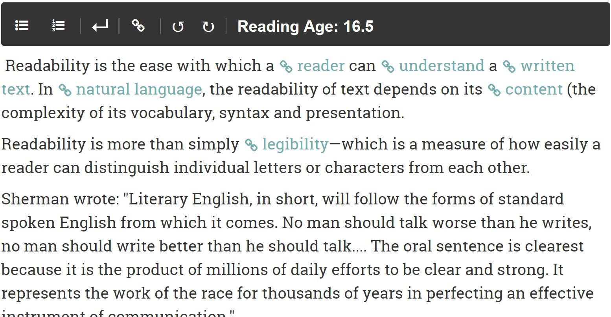
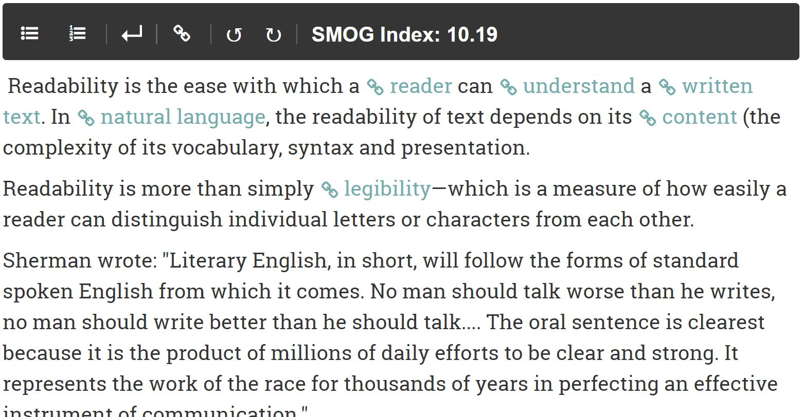

# wagtail-readinglevel
A lightweight Wagtail plugin to determine the reading level of text input into a rich text field.

Currently there are two available modes:
1. (Default) Reading Age - calculated using the [Automated Readability Index]
(https://en.wikipedia.org/wiki/Automated_readability_index) 
  ---
2. SMOG Index - calculates the [SMOG Index](https://en.wikipedia.org/wiki/SMOG) (only suitable for English). 

!! This is an experimental build meant to test yet unreleased api features in Wagtail. It uses a monkeypatch to work specifically with Wagtail 2.0 and will likely break in a future release of Wagtail. !!

## Installation
- ```pip install wagtail-readinglevel```
- add ```wagtailreadinglevel``` and/or ```wagtailreadinglevelsmog``` to your list of installed apps AFTER all wagtail app includes (e.g. wagtail.admin, wagtail.core etc.).

## Usage
Once installed You will see the reading level and/or smog index displayed in the toolbar of all rich text fields in your Wagtail admin area (depending on which you added to your list of installed apps).
